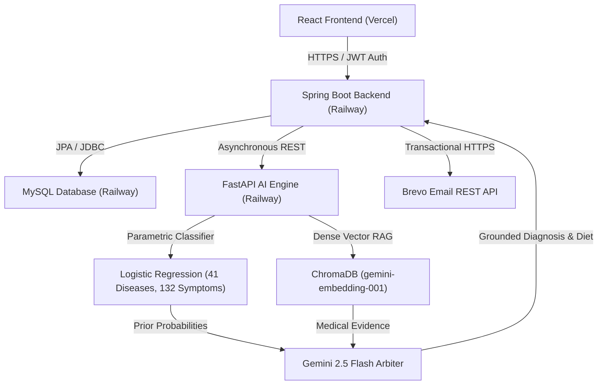

# 🏥 Clinova: Smart Clinical Command Center & AI Triage System

Clinova is an enterprise-grade, cloud-deployed, AI-assisted Clinical Command Center and Staff Orchestration platform. It decouples complex clinical scheduling, database administration, and artificial intelligence diagnostic reasoning into a unified, high-performance microservice architecture.

> [!TIP]
> 📖 **Full System Architecture Document:** For complete High-Level Design (HLD), Low-Level Design (LLD), component class diagrams, and multi-turn sequence diagrams, see [SYSTEM_ARCHITECTURE_HLD_LLD.md](./SYSTEM_ARCHITECTURE_HLD_LLD.md).

---

## 🗺️ System Architecture

Clinova utilizes a secure service-oriented model to separate patient interfaces, business logic, relational storage, and artificial intelligence reasoning engines:



---

## ✨ Core Features

### 👤 1. Patient Portal & Wellness Center
* **Hybrid AI Triage Engine (41 Conditions, 132 Symptoms)**: Combines statistical classification (calibrated Logistic Regression) with dense vector semantic search (ChromaDB + `gemini-embedding-001`) and cognitive arbitration (Gemini 2.5 Flash).
* **Empirical Diagnostic Tie-Breaking**: Automatically detects when patient confidence is ambiguous ($< 65\%$) and asks targeted clinical discriminator questions.
* **Evidence-Grounded Explanations**: Generates natural language rationales citing hallmark and excluded symptoms from clinical reference literature.
* **Tailored 2-Day Recovery Diets**: Automatically designs custom, vitals-aware daily nutrition plans on triage completion.
* **Instant Specialist Booking**: Automatically maps diagnoses to 41 clinical specialties and links directly to physician availability grids.
* **Simulated Secure Payment Gateway**: Multi-step payment validation for secure patient copays.

### 🩺 2. Physician Workspace
* **Live Patient Queue**: Visually tracks and displays active, upcoming, and past daily appointments.
* **Sovereign Availability Scheduler**: Empowers doctors to self-manage their weekly active hour blocks directly.
* **Clinical Records Workspace**: Integrated form to compile prescriptions, clinical notes, and view Gemini-analyzed triage diagnostics.
* **Virtual Consultations**: WebRTC-ready video portal mapped directly to live virtual appointments.

### 👑 3. Admin Command Center
* **Staff Orchestration**: Centralized calendar grid managing weekly scheduling blocks for all verified staff.
* **Verification Portal**: Professional directory to audit, approve, and certify pending medical practitioner registrations.
* **Live System Metrics**: Observability charts tracking total visits, pending approvals, and active clinical consults.

---

## 🔬 Empirical Model & RAG Performance

The AI engine was benchmarked on **984 held-out stratified test records** across 41 diseases and 132 symptoms:

### Model Benchmark: Logistic Regression vs. Random Forest
* **Logistic Regression (Production)**: **100.00% Accuracy**, **1.00 Macro F1** (Selected for calibrated Bayesian posterior probabilities needed for clinical thresholding).
* **Random Forest Baseline**: **100.00% Accuracy**, **1.00 Macro F1**.

### Real-World Symptom Ablation Study
When patients report sparse, realistic complaints instead of complete textbook vectors:

| Symptoms Shown ($k$) | Mean Classifier Confidence | Classifier Accuracy | % Cases Below Triage Threshold ($< 65\%$) | % Cases in Genuine Tie (Margin $< 15\%$) |
| :---: | :---: | :---: | :---: | :---: |
| **$k = 2$ symptoms** | **28.63%** | **59.86%** | **90.35%** | **52.34%** |
| **$k = 3$ symptoms** | **46.41%** | **74.29%** | **66.36%** | **38.82%** |
| **$k = 4$ symptoms** | **60.11%** | **86.08%** | **45.43%** | **25.51%** |
| **Full Textbook** | **96.21%** | **100.00%** | **0.00%** | **0.00%** |

*Takeaway:* At initial intake ($k=2$), the classifier alone is in a tie **52.34% of the time**. The ChromaDB RAG layer provides the differential medical evidence that allows the Gemini arbiter to break ties accurately.

---

## 🛠️ Technology Stack

| Layer | Technologies |
| :--- | :--- |
| **Frontend** | React.js, Tailwind CSS, Axios, Heroicons, Recharts |
| **Backend API** | Java 21, Spring Boot 3.x, Spring Security 6, JWT, JPA, Hibernate, MySQL 8 |
| **AI Triage Microservice** | Python 3.12, FastAPI, Google Gemini 2.5 Flash, `gemini-embedding-001`, ChromaDB, Scikit-Learn, Pandas, NumPy |
| **Integrations** | Brevo HTTP Mail Client API (Port 443 HTTPS REST), Google GenAI SDK |

---

## 🚀 Local Development Setup

### Prerequisites
* **Java**: JDK 21+ installed and configured.
* **Python**: Python 3.10+ installed.
* **Node.js**: Node 18+ installed.
* **Database**: MySQL Server running locally (default fallback port `3306`).

---

### Step 1: Start MySQL Database
1. Open your MySQL client and run:
   ```sql
   CREATE DATABASE clinic_db;
   ```

---

### Step 2: Configure and Launch the Python AI Triage Engine
1. Navigate to the AI engine folder:
   ```bash
   cd ai-triage-engine
   ```
2. Create and activate a python virtual environment:
   ```bash
   python -m venv venv
   # On Windows:
   .\venv\Scripts\activate
   # On macOS/Linux:
   source venv/bin/activate
   ```
3. Install dependencies:
   ```bash
   pip install -r requirements.txt
   ```
4. Set your Google Gemini API Key:
   ```bash
   # On Windows (cmd):
   set GEMINI_API_KEY=your_gemini_api_key_here
   # On macOS/Linux:
   export GEMINI_API_KEY=your_gemini_api_key_here
   ```
5. Start the FastAPI server:
   * **On Windows**:
     ```bash
     start_ai.bat
     ```
   * **On macOS/Linux**:
     ```bash
     uvicorn main:app --reload --port 8000
     ```

---

### Step 3: Configure and Run the Spring Boot Backend
1. Navigate to the backend folder:
   ```bash
   cd ../backend
   ```
2. Configure credentials in `src/main/resources/application.properties` (defaults to port `3306`, username `root`, password `harsh@945`).
3. Set your environment variables:
   ```bash
   # On Windows:
   set GEMINI_API_KEY=your_gemini_api_key_here
   set BREVO_API_KEY=your_brevo_api_key_here
   # On macOS/Linux:
   export GEMINI_API_KEY=your_gemini_api_key_here
   export BREVO_API_KEY=your_brevo_api_key_here
   ```
4. Compile and start the server:
   ```bash
   # On Windows:
   .\mvnw.cmd spring-boot:run
   # On macOS/Linux:
   ./mvnw spring-boot:run
   ```

---

### Step 4: Launch the React Frontend
1. Navigate to the frontend folder:
   ```bash
   cd ../frontend
   ```
2. Install package dependencies:
   ```bash
   npm install
   ```
3. Start the Vite/CRA dev server:
   ```bash
   npm start
   ```
4. Open your browser and navigate to `http://localhost:3000` to access Clinova!

---

## 🎯 Production Cloud Deployments

Clinova uses automated CI/CD pipelines:

### Frontend (Vercel)
* **Root Directory**: `frontend`
* **Build Command**: `npm run build`
* **Output Directory**: `build`
* **Environment Variable**: `REACT_APP_API_URL` set to your live Spring Boot URL.

### Backend (Railway)
* **Java API Service**: Root Directory set to `/backend`. Port binds dynamically to `${PORT:8080}`.
* **MySQL Service**: Dynamic instance linked to Java datasource configurations.
* **Python AI Service**: Root directory `/ai-triage-engine`. Environment variable `GEMINI_API_KEY` bound to Google AI studio credentials.
* **Linking**: Java backend uses `PYTHON_API_URL` targeting the Python microservice URL + `/api/v1/chat`.