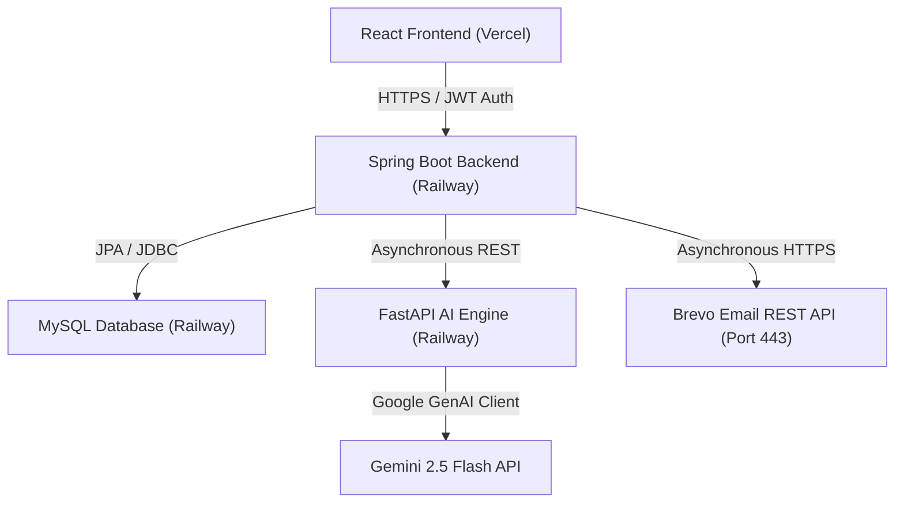

# 🏥 Clinova: Smart Clinical Command Center & AI Triage System

Clinova is an enterprise-grade, cloud-deployed, AI-assisted Clinical Command Center and Staff Orchestration platform. It decouples complex clinical scheduling, database administration, and artificial intelligence diagnostic reasoning into a unified, high-performance service architecture.

---

## 🗺️ System Architecture

Clinova utilizes a secure service-oriented model to separate patient interfaces, business logic, relational storage, and artificial intelligence reasoning engines:



---

## ✨ Core Features

### 👤 1. Patient Portal & Wellness Center
* **Empathetic AI Triage Chat**: Real-time diagnostic chatbot powered by Scikit-Learn classification algorithms and Gemini LLM context memory.
* **Tailored 2-Day Diets**: Automatically designs custom, vitals-aware daily nutrition plans on triage completion.
* **Instant Booking**: Fetches real-time physician hours grids, allowing patients to schedule physically or virtually.
* **Simulated Secure Payment Gateway**: Multi-step payment widget validation for secure patient copays.

### 🩺 2. Physician Workspace
* **Live Patient Queue**: Visually tracks and displays active, upcoming, and past daily appointments.
* **Sovereign Availability Scheduler**: Empowers doctors to self-manage their weekly active hour blocks directly.
* **Clinical Records Workspace**: Integrated form to compile prescriptions, clinical notes, and view Gemini-analyzed triage diagnostics.
* **Virtual Consultations**: WebRTC-ready video portal mapped directly to live virtual appointments.

### 👑 3. Admin Command Center
* **Staff Orchestration**: Centralized calendar grid managing weekly scheduling blocks for all verified staff.
* **Verification Portal**: Professional directory to audit, approve, and certify pending medical practitioner registrations.
* **Live System Metrics**: Observability charts tracking total visits, pending approvals, and active clinical consults.

---

## 🛠️ Technology Stack

| Layer | Technologies |
| :--- | :--- |
| **Frontend** | React.js, Tailwind CSS, Axios, Heroicons, Recharts |
| **Backend API** | Java 21, Spring Boot 3.x, Spring Security 6, JWT, JPA, Hibernate, MySQL |
| **AI Triage Microservice** | Python 3.10+, FastAPI, Gemini 2.5 Flash, Scikit-Learn Classifiers, NumPy |
| **Integrations** | Brevo HTTP Mail Client API, Port 443 (HTTPS REST) |

---

## 🚀 Local Development Setup

To run the entire Clinova ecosystem on your local machine:

### Prerequisites
* **Java**: JDK 21+ installed and configured.
* **Python**: Python 3.10+ installed.
* **Node.js**: Node 18+ installed.
* **Database**: MySQL Server running locally (default fallback port `3306`).

---

### Step 1: Start MySQL Database
1. Open your MySQL client and run:
   ```sql
   CREATE DATABASE clinic_db;
   ```

---

### Step 2: Configure and Launch the Python AI Triage Engine
1. Navigate to the AI engine folder:
   ```bash
   cd ai-triage-engine
   ```
2. Create and activate a python virtual environment:
   ```bash
   python -m venv venv
   # On Windows:
   .\venv\Scripts\activate
   # On macOS/Linux:
   source venv/bin/activate
   ```
3. Install dependencies:
   ```bash
   pip install -r requirements.txt
   ```
4. Set your Google Gemini API Key:
   ```bash
   # On Windows (cmd):
   set GEMINI_API_KEY=your_gemini_api_key_here
   # On macOS/Linux:
   export GEMINI_API_KEY=your_gemini_api_key_here
   ```
5. Start the FastAPI server:
   ```bash
   uvicorn main:app --reload --port 8000
   ```

---

### Step 3: Configure and Run the Spring Boot Backend
1. Navigate to the backend folder:
   ```bash
   cd ../backend
   ```
2. *(Optional)* Update your database credentials in `src/main/resources/application.properties` (defaults to port `3306`, username `root`, password `harsh@945`).
3. Set your environment variables:
   ```bash
   # On Windows:
   set GEMINI_API_KEY=your_gemini_api_key_here
   set BREVO_API_KEY=your_brevo_api_key_here
   # On macOS/Linux:
   export GEMINI_API_KEY=your_gemini_api_key_here
   export BREVO_API_KEY=your_brevo_api_key_here
   ```
4. Compile and start the server:
   ```bash
   # On Windows:
   .\mvnw.cmd spring-boot:run
   # On macOS/Linux:
   ./mvnw spring-boot:run
   ```

---

### Step 4: Launch the React Frontend
1. Navigate to the frontend folder:
   ```bash
   cd ../frontend
   ```
2. Install package dependencies:
   ```bash
   npm install
   ```
3. Start the Vite/CRA dev server:
   ```bash
   npm start
   ```
4. Open your browser and navigate to `http://localhost:3000` to access the Clinova workspace!

---

## 🎯 Production Cloud Deployments

Clinova uses automated CI/CD pipelines:

### Frontend (Vercel)
* **Root Directory**: `frontend`
* **Build Command**: `npm run build`
* **Output Directory**: `build`
* **Environment Variable**: `REACT_APP_API_URL` set to your live Spring Boot URL (e.g. `https://your-api.railway.app/api`).

### Backend (Railway)
* **Java API Service**: Root Directory set to `/backend`. Port binds dynamically to the cloud environment.
* **MySQL Service**: Dynamic instance automatically linked to Java datasource configurations.
* **Python AI Service**: Root directory `/ai-triage-engine`. Environment variable `GEMINI_API_KEY` bound to Google AI studio credentials.
* **Linking**: Java backend uses `PYTHON_API_URL` environment variable targeting the Python microservice URL + `/api/v1/chat`.