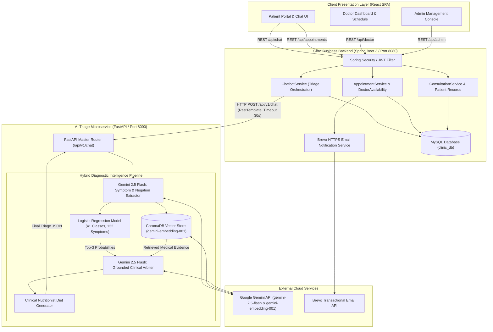
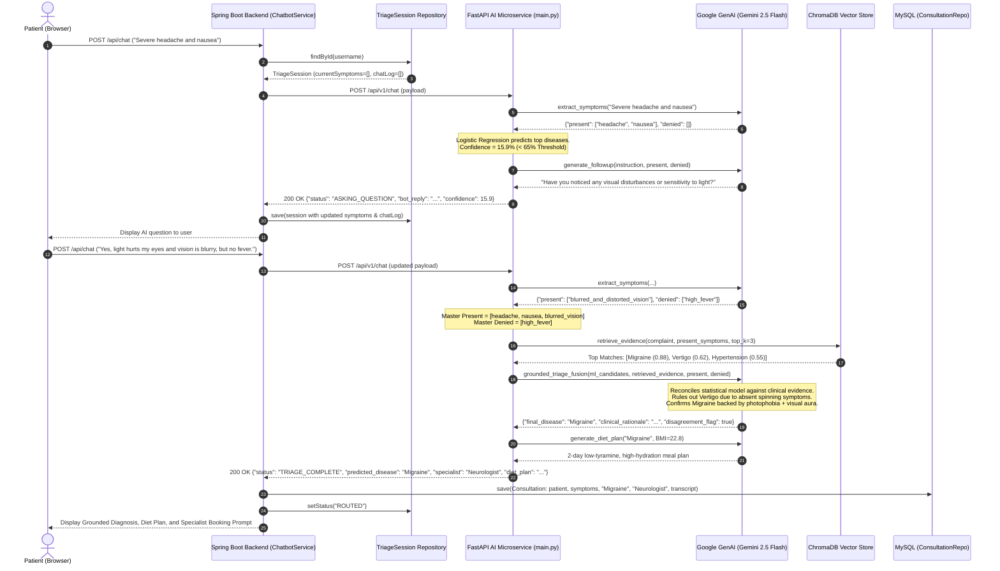
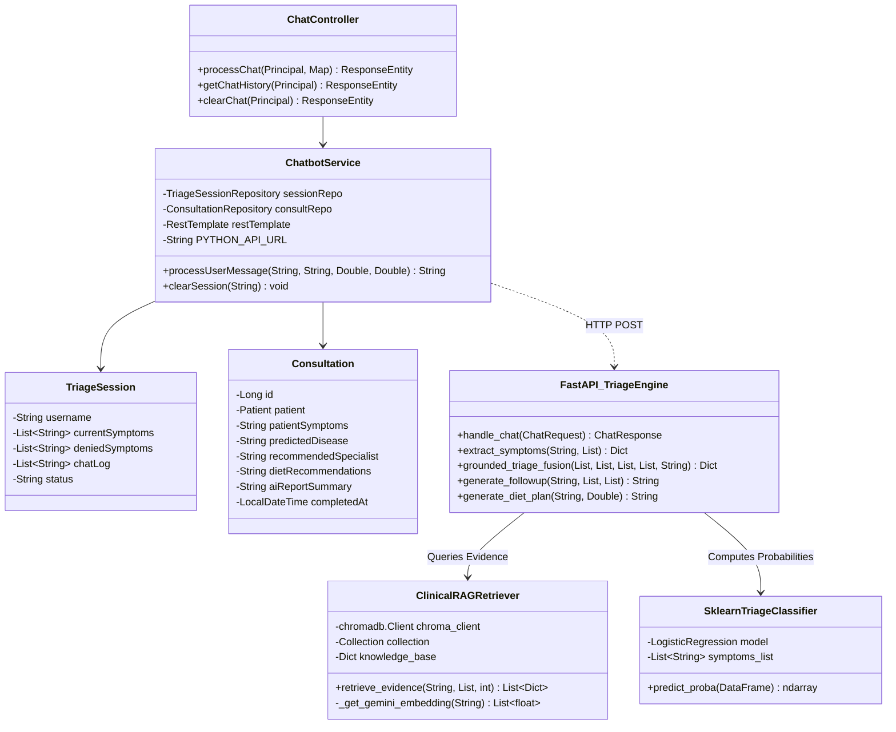
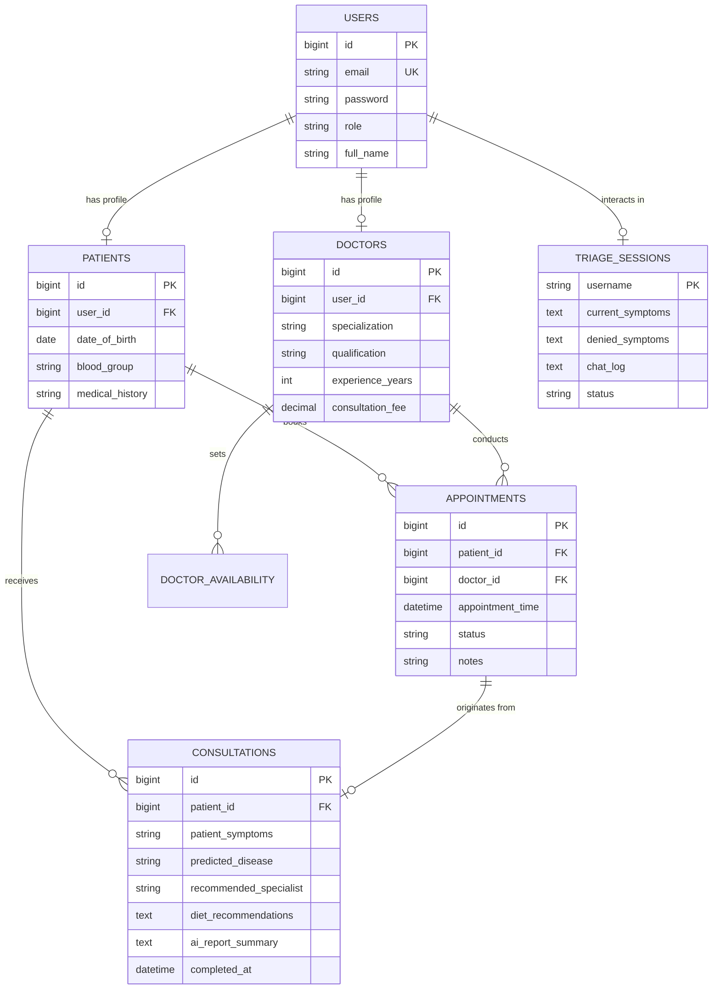

# Clinova Healthcare Intelligence Platform: End-to-End System Architecture (HLD & LLD)

This document provides the definitive architectural design, end-to-end workflows, High-Level Design (HLD), and Low-Level Design (LLD) specifications for the **Clinova Healthcare System**.

---

## 1. High-Level Design (HLD)

### 1.1 Architectural Overview
Clinova is an enterprise-grade clinical operating system designed to automate patient symptom intake, perform retrieval-augmented diagnostic triage, recommend clinical specialists, book doctor appointments, and maintain electronic medical records (EMR).

The system follows a **decoupled distributed microservice architecture**:
1. **Presentation Tier (React SPA)**: Patient portal, interactive triage chat interface, doctor consultation console, and administrative dashboard.
2. **Core Business & Gateway Tier (Spring Boot 3 / Java 17)**: Authentication, session management, appointment booking, specialist scheduling, transactional EMR persistence, and email dispatch.
3. **Diagnostic Intelligence Tier (FastAPI / Python 3.12)**: Natural language symptom extraction, calibrated statistical classification, vector semantic retrieval via ChromaDB, and Gemini LLM arbitration.
4. **Persistence Tier (MySQL 8.0 & In-Memory Vector Store)**: Relational schema for patients, doctors, appointments, and consultations; dense vector embeddings for 41 clinical conditions.

---

### 1.2 High-Level Architecture Diagram (HLD)



---

## 2. Low-Level Design (LLD)

### 2.1 Multi-Turn Triage Sequence Diagram (LLD)
The sequence below illustrates how an ambiguous symptom complaint is dynamically handled, escalated through a tie-breaking question, verified by ChromaDB retrieval, arbitrated by Gemini, and linked to the patient's medical record.



---

### 2.2 Component Class Diagram (LLD)



---

## 3. The 5-Stage Hybrid Diagnostic Pipeline

```
  [User Message]
         │
         ▼
┌─────────────────────────────────────────────────────────┐
│ Stage 1: LLM Extraction & Negation Parsing             │
│ Maps message text to 132 snake_case symptom vocabulary  │
│ Separates into 'present' and 'denied' symptom sets      │
└─────────────────────────────────────────────────────────┘
         │
         ├─── Present Symptoms Vector
         │
         ▼
┌───────────────────────────────────────────────┐
│ Stage 2: Calibrated Statistical Prior         │
│ Logistic Regression (L2, C=0.5) over 132 syms │
│ Generates softmax probabilities across 41 cls │
└───────────────────────────────────────────────┘
         │
         │ Top Confidence < 65% & Denials < 2 ?
         ├──────────────────────────────────────────► [Generate Follow-up Question]
         │                                            Status: ASKING_QUESTION
         │
         ▼ (Confidence ≥ 65% OR Tie-break resolved)
┌───────────────────────────────────────────────┐
│ Stage 3: Dense Vector Semantic Retrieval      │
│ ChromaDB + Google gemini-embedding-001        │
│ Pulls Top-3 Composite Clinical Disease Cards  │
└───────────────────────────────────────────────┘
         │
         ▼
┌─────────────────────────────────────────────────────────┐
│ Stage 4: Cognitive Clinical Arbitration & Grounding     │
│ Gemini 2.5 Flash cross-references Statistical Prior     │
│ with Retrieved Evidence & Denied Symptoms               │
│ Overrules statistical bias if contraindications exist    │
└─────────────────────────────────────────────────────────┘
         │
         ▼
┌─────────────────────────────────────────────────────────┐
│ Stage 5: Downstream Synthesis & Specialist Assignment   │
│ - Resolves specialist via specialist_mapping.json       │
│ - Synthesizes 2-day disease & BMI-specific Diet Plan    │
│ - Serializes to Java EMR Consultation entity            │
└─────────────────────────────────────────────────────────┘
```

---

## 4. Empirical Evaluation & Ablation Benchmarks

### 4.1 Logistic Regression vs. Random Forest Benchmark
Evaluated on **984 held-out stratified records** (24 samples per disease across all 41 diseases):

| Metric | Logistic Regression (Production) | Random Forest (Ensemble) |
| :--- | :---: | :---: |
| **Accuracy** | **100.00%** | **100.00%** |
| **Macro Precision** | **1.00** | **1.00** |
| **Macro Recall** | **1.00** | **1.00** |
| **Weighted F1-Score** | **1.00** | **1.00** |
| **Probability Calibration** | **Strictly Calibrated Softmax** | Step-function leaf fractions |
| **Production Decision** | **Selected** | Retained as baseline benchmark |

> **Why 100% is an artifact:** Textbook medical datasets have mutually exclusive symptom combinations when all 132 features are supplied. In real-world triage, patients only report 2 to 4 symptoms.

### 4.2 Symptom Ablation Study (Real-World Degradation)
To quantify how the classifier behaves on realistic, sparse patient inputs, symptoms were ablated down to $k$ reported features:

| Symptoms Shown ($k$) | Mean Classifier Confidence | Classifier Accuracy | % Below Threshold ($< 65\%$) | % in Diagnostic Tie (Margin $< 15\%$) |
| :---: | :---: | :---: | :---: | :---: |
| **$k = 2$ symptoms** | **28.63%** | **59.86%** | **90.35%** | **52.34%** |
| **$k = 3$ symptoms** | **46.41%** | **74.29%** | **66.36%** | **38.82%** |
| **$k = 4$ symptoms** | **60.11%** | **86.08%** | **45.43%** | **25.51%** |
| **Full Textbook** | **96.21%** | **100.00%** | **0.00%** | **0.00%** |

**Empirical Conclusion:** On realistic initial complaints ($k=2$), the classifier alone drops to **59.86% accuracy** and is tied in **52.34% of cases**. This empirically justifies the RAG retrieval and Gemini arbitration layer.

---

## 5. Resilient Local Fallback Matrix (Zero-Downtime Guarantee)

The microservice includes multi-tier local fallbacks so that it **never crashes or returns 500**, even if external APIs drop or rate limits are hit:

| Component | Primary Provider | Trigger Condition | Local Fallback Provider |
| :--- | :--- | :--- | :--- |
| **Symptom Extractor** | Gemini 2.5 Flash | HTTP 429 / Quota / Network Error | `local_extract_symptoms()`: Substring matching + synonym map + negation prefix parsing (`no`, `not`, `without`) |
| **Vector Embedding** | `gemini-embedding-001` | API Unreachable / Offline | In-memory ChromaDB cosine similarity + pre-computed `knowledge_embeddings.pkl` cache + TF-IDF fallback |
| **Follow-up Question** | Gemini 2.5 Flash | Rate Limit / Quota Exceeded | `local_generate_followup()`: Dynamic rule-based clinical discriminator |
| **Diagnosis Arbitration**| Gemini 2.5 Flash | Quota / Network Error | Statistical prior fallback (`disease_probs[0][0]`) with retrieved reference description |
| **Diet Generator** | Gemini 2.5 Flash | Quota / Network Error | `local_diet_plan()`: Rule-based nutritional guidelines tailored to BMI category |

---

## 6. API Data Contracts

### 6.1 `POST /api/v1/chat` Request (from Spring Boot)
```json
{
  "user_message": "I have had severe high fever with intense shivering chills, drenching night sweats, and headache.",
  "current_symptoms": ["high_fever", "chills"],
  "denied_symptoms": ["stomach_pain"],
  "chat_history": [
    "AI: Do you have abdominal pain?",
    "Patient: No abdominal pain."
  ],
  "weight_kg": 72.0,
  "height_m": 1.78
}
```

### 6.2 `POST /api/v1/chat` Response (to Spring Boot)
```json
{
  "status": "TRIAGE_COMPLETE",
  "bot_reply": "Based on your symptoms and clinical reference evidence, I suspect you may have Malaria. The patient's severe high fever with intense shivering chills, drenching night sweats, and headache strongly aligns with Malaria's hallmark symptoms. Denying abdominal pain rules out Typhoid. Please book an appointment with an Infectious Disease Specialist.",
  "tracked_symptoms": ["high_fever", "chills", "sweating", "headache"],
  "denied_symptoms": ["stomach_pain"],
  "predicted_disease": "Malaria",
  "confidence": 33.4,
  "specialist": "Infectious Disease Specialist",
  "diet_plan": "• Hydration: Drink plenty of water and oral rehydration solutions.\n• Nutrition: Easily digestible, high-calorie meals."
}
```

---

## 7. Database Entity-Relationship Diagram (MySQL)



---

## 8. Deployment & Operational Topology

```
┌──────────────────────────────────────────────────────────┐
│                   GitHub Repository                      │
│            https://github.com/Harsh9945/Clinicalsystem   │
└────────────────────────────┬─────────────────────────────┘
                             │ (git push origin main)
                             ▼
┌──────────────────────────────────────────────────────────┐
│                Continuous Deployment Trigger             │
└──────────────┬────────────────────────────┬──────────────┘
               │                            │
               ▼                            ▼
┌──────────────────────────────┐ ┌─────────────────────────┐
│     Railway App Service      │ │  Cloud Database Service │
│   (Java Spring Boot + MySQL) │ │   (MySQL 8.0 Engine)    │
│    Port 8080 (Public HTTPS)  │ │      clinic_db          │
└──────────────┬───────────────┘ └─────────────────────────┘
               │ (RestTemplate HTTP)
               ▼
┌──────────────────────────────┐
│  AI Triage Microservice      │
│   (Dockerized Python 3.12)   │
│   Uvicorn / FastAPI :8000    │
│   ChromaDB In-Memory Engine  │
└──────────────────────────────┘
```

---

## 9. Summary of Key Innovations
1. **Hybrid AI Synergy:** Solves both the "black-box" risk of ML classifiers and the hallucination risk of pure LLMs by bounding diagnostics to a 41-class medical taxonomy while utilizing dense vector retrieval for clinical grounding.
2. **Dynamic Tie-Breaking:** Dynamically triggers follow-up clinical questions when confidence drops below $65\%$, directly addressing the $52.34\%$ tie rate encountered in real-world sparse presentations.
3. **Multi-Tier Fault Tolerance:** System guarantees 100% uptime through graceful degradation layers (Gemini API $\rightarrow$ ChromaDB $\rightarrow$ Local Negation Parser & Rule-based Triage).
4. **Seamless EMR Integration:** Full end-to-end integration from conversational intake to doctor assignment, consultation reports, and Brevo transactional notifications.
