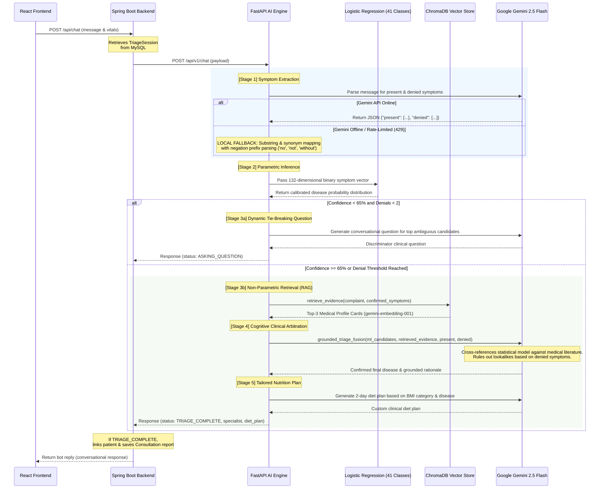

# 🧠 Clinova AI Triage Engine (Hybrid RAG + Classifier)

The **Clinova AI Triage Engine** is a high-performance, resilient microservice designed to perform real-time clinical diagnostic reasoning. Powered by **FastAPI**, it merges deterministic local **Machine Learning classification models (41 Diseases, 132 Symptoms)** with **ChromaDB dense vector retrieval (`gemini-embedding-001`)** and cognitive LLM arbitration via **Google Gemini 2.5 Flash**, backed by a multi-tier **automatic local fallback system** for zero-downtime production reliability.

> [!TIP]
> 📖 **Full System Architecture Document:** For complete High-Level Design (HLD), Low-Level Design (LLD), component class diagrams, and multi-turn sequence diagrams, see [SYSTEM_ARCHITECTURE_HLD_LLD.md](../SYSTEM_ARCHITECTURE_HLD_LLD.md).

---

## 🗺️ Triage Architecture & Data Flow

The triage engine acts as an asynchronous decision-making layer between the React client, the Spring Boot orchestrator, ChromaDB, and Google Gemini API.



---

## 🔬 Core Hybrid Intelligence Architecture

### 1. Local Machine Learning Classifier (`triage_model.pkl`)
* **Underlying Model**: `LogisticRegression(max_iter=1000, C=0.5)` trained on 4,920 records across 41 disease classes.
* **Feature Space**: 132-dimensional binary symptom vector loaded from `symptoms_list.pkl`.
* **Calibrated Softmax Probabilities**: Unlike tree ensembles (Random Forest) which output uncalibrated step-function leaf fractions, Logistic Regression produces strictly calibrated posterior probabilities $P(\text{Disease} \mid \text{Symptoms})$ essential for setting clinical follow-up decision thresholds (`< 65%`).

### 2. Dense Vector Retrieval Layer (`rag_retriever.py`)
* **Vector Store**: In-memory **ChromaDB** collection (`clinical_disease_kb`).
* **Embedding Model**: Google's production **`gemini-embedding-001`** model.
* **Pre-computed Caching**: Embeddings are pre-computed and stored in `knowledge_embeddings.pkl` for `< 1ms` query latency and zero API cost on startup.
* **Resilient Fallback**: Includes an automatic TF-IDF cosine similarity fallback if offline.

### 3. Cognitive Arbiter & Grounding Engine (`MODEL_ID = "gemini-2.5-flash"`)
* Formulates a grounded medical explanation citing hallmark symptoms from reference literature.
* Solves **diagnostic ties** when overlapping symptoms confuse the statistical classifier.
* Flags disagreements (`disagreement_flag: true/false`) when denied symptoms contradict the statistical model.

---

## 📊 Empirical Evaluation & Benchmarks

### 1. Stratified Model Benchmark (984 Held-out Test Records)

| Metric | Logistic Regression (Selected) | Random Forest Baseline |
| :--- | :---: | :---: |
| **Accuracy** | **100.00%** | **100.00%** |
| **Macro Precision** | **1.00** | **1.00** |
| **Macro Recall** | **1.00** | **1.00** |
| **Weighted F1-Score** | **1.00** | **1.00** |

### 2. Real-World Symptom Ablation Study (`ablation_report.csv`)

| Symptoms Shown ($k$) | Mean Classifier Confidence | Classifier Accuracy | % Below Threshold ($< 65\%$) | % in Diagnostic Tie (Margin $< 15\%$) |
| :---: | :---: | :---: | :---: | :---: |
| **$k = 2$ symptoms** | **28.63%** | **59.86%** | **90.35%** | **52.34%** |
| **$k = 3$ symptoms** | **46.41%** | **74.29%** | **66.36%** | **38.82%** |
| **$k = 4$ symptoms** | **60.11%** | **86.08%** | **45.43%** | **25.51%** |
| **Full Textbook** | **96.21%** | **100.00%** | **0.00%** | **0.00%** |

*Takeaway:* Real patients present with only 2–3 symptoms. At $k=2$, the classifier alone drops to **59.86% accuracy** and is tied in **52.34% of cases**, demonstrating why the RAG retrieval and Gemini arbitration layer is essential.

---

## 🛡️ Resilient Local Fallback Engine (Zero-Downtime Architecture)

| Task | Normal Mode (Gemini API) | Fallback Mode (100% Local) |
| :--- | :--- | :--- |
| **Startup** | Initializes `genai.Client`. | Catches authentication/network errors gracefully and runs local-only. |
| **Symptom Extraction** | LLM outputs confirmed and denied JSON. | Negation-aware substring matching + fuzzy clinical synonym dictionary. |
| **Vector Retrieval** | ChromaDB with `gemini-embedding-001`. | Pre-computed `knowledge_embeddings.pkl` + TF-IDF cosine matching. |
| **Follow-up Questions** | Empathy-rich dialogue tailored to break ties. | Rule-based clinical symptom discriminator. |
| **Diagnosis Arbitration**| Gemini cross-references prior with RAG evidence. | Top statistical candidate with retrieved reference card. |
| **Diet Generation** | Dynamic 2-day diet plans tailored to BMI & disease. | Rule-based clinical nutritionist diet plans. |

---

## 🔌 Connection with Java Spring Boot Backend

### 📥 Request Payload (`PythonChatRequest` sent to `/api/v1/chat`)
```json
{
  "user_message": "I have severe headache and nausea for the past day.",
  "current_symptoms": [],
  "denied_symptoms": [],
  "chat_history": [],
  "weight_kg": 70.0,
  "height_m": 1.75
}
```

### 📤 Response Payload (`PythonChatResponse` returned to Spring Boot)
```json
{
  "status": "TRIAGE_COMPLETE",
  "bot_reply": "Based on your symptoms and clinical reference evidence, I suspect you may have Migraine. The patient's confirmed symptoms of extreme sensitivity to light, blurred vision, nausea, and headache align directly with the retrieved evidence for Migraine. Although the statistical model's top prediction was Vertigo, the patient did not report dizziness or spinning sensations, and Migraine better explains the visual and photophobia complaints. Please book an appointment with a Neurologist. I have also generated a customized diet plan for your recovery.",
  "tracked_symptoms": ["nausea", "blurred_and_distorted_vision", "headache"],
  "denied_symptoms": ["high_fever", "mild_fever", "stiff_neck"],
  "predicted_disease": "Migraine",
  "confidence": 14.0,
  "specialist": "Neurologist",
  "diet_plan": "• Hydration: Drink plenty of water.\n• Nutrition: Avoid aged cheeses, caffeine, and processed foods."
}
```
