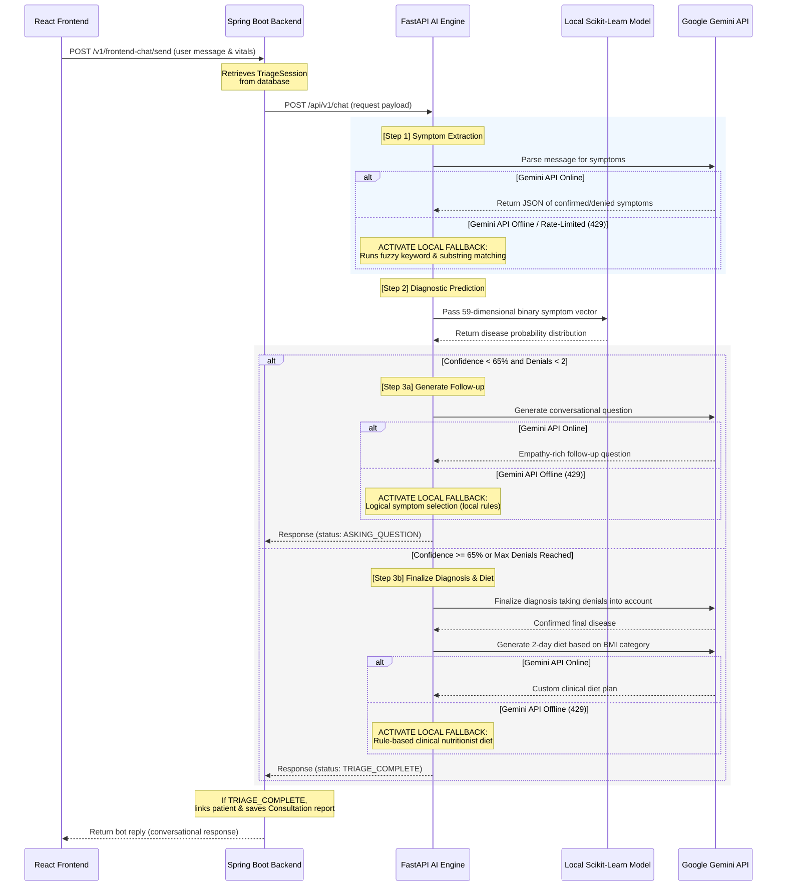

# 🧠 Clinova AI Triage Engine

The **Clinova AI Triage Engine** is a high-performance, resilient microservice designed to perform real-time clinical diagnostic reasoning. Powered by **FastAPI**, it merges deterministic local **Machine Learning classification models** with the context-aware reasoning of **Google Gemini API**, backed by a robust **automatic local fallback system** for extreme production reliability.

---

## 🗺️ Triage Architecture & Data Flow

The triage engine acts as an asynchronous decision-making layer between the React client, the Spring Boot orchestrator, and the Google Gemini API.



---

## 🔬 Core Hybrid Intelligence Architecture

### 1. Local Machine Learning Classifier (`triage_model.pkl`)
* **Underlying Model**: A Scikit-Learn classifier trained on thousands of symptom-disease associations.
* **Feature Space**: A strict 59-dimensional binary vector representing clinical symptoms loaded from `symptoms_list.pkl`.
* **Processing**:
  * Confirmed symptoms are mapped to their index in the features list and set to `1` (all other dimensions set to `0`).
  * The vector is loaded into a Pandas DataFrame with valid feature names:
    ```python
    input_df = pd.DataFrame([input_data], columns=symptoms_list)
    probabilities = model.predict_proba(input_df)[0]
    ```
  * Predicts the top 3 suspected diseases along with their exact mathematical confidence scores.

### 2. Google Gemini API Key Integration (`MODEL_ID = "gemini-2.5-flash"`)
* Uses the new official **Google GenAI SDK** (`from google import genai`).
* It is combined with the local model to perform three advanced NLP/clinical tasks:
  1. **Clinical Data Extraction**: Normalizes conversational user inputs into strict snake_case symptom IDs and tracks symptom denials (e.g., *"I don't have a cough"* $\rightarrow$ added to `denied_symptoms`).
  2. **Empathetic Follow-up Generation**: Frames medical-grade, nurse-like questions dynamically based on suspected clinical tie-breakers.
  3. **Personalized Nutrition Planning**: Generates customized 2-day recovery plans tailored to the patient's diagnostic result and BMI (calculated dynamically from weight and height).

---

## 🛡️ Resilient Local Fallback Engine (No-Crash Architecture)

To guarantee the chatbot **never crashes** if the Gemini API key runs out of daily quota (Resource Exhausted `429` error) or becomes completely offline, the engine implements a bulletproof local fallback system:

| Task | Normal Mode (Gemini API) | Fallback Mode (100% Local) |
| :--- | :--- | :--- |
| **Startup** | Initializes standard `genai.Client`. | Catches authentication errors gracefully and sets `client = None` to run in local-only mode. |
| **Symptom Extraction** | LLM reads history and patient input to output confirmed/denied JSON. | Scans patient input using case-insensitive substring matching and a comprehensive fuzzy clinical synonym dictionary. |
| **Follow-up Questions** | Empathy-rich dialogue tailored to break ties between suspected diseases. | Inspects unconfirmed symptoms, selects the most common clinical suspects, and formats a friendly symptom check question. |
| **Diet Generation** | Dynamic 2-day diet plans customized to the patient's BMI tier and disease. | Applies rule-based clinical nutrition logic to generate structured hydration, meal plans, and restriction lists tailored to the disease. |
| **Global safety net** | Executes the standard hybrid pipeline. | Wraps the `/api/v1/chat` endpoint in a try-catch handler to return local ML results if any unexpected API crash occurs. |

---

## 🔌 Connection with the Java Spring Boot Backend

### 1. Payload Structures

The Spring Boot backend (`ChatbotService.java`) acts as an orchestrator, maintaining a stateful **Triage Session** in the MySQL database and making a standard REST request using `RestTemplate` to the Python microservice:

#### 📥 Request Payload (`PythonChatRequest` sent to `/api/v1/chat`)
```json
{
  "user_message": "I have stomach pain and feel feverish",
  "current_symptoms": ["fatigue"],
  "denied_symptoms": ["headache"],
  "chat_history": [
    "Patient: I feel very tired.",
    "AI: I see. Do you have a headache?"
  ],
  "weight_kg": 75.0,
  "height_m": 1.78
}
```

#### 📤 Response Payload (`PythonChatResponse` returned to Spring Boot)
```json
{
  "status": "ASKING_QUESTION", 
  "bot_reply": "Understood. To help narrow down the diagnosis, are you experiencing any nausea?",
  "tracked_symptoms": ["fatigue", "stomach_pain", "high_fever"],
  "denied_symptoms": ["headache"],
  "predicted_disease": "Pending",
  "confidence": 53.5,
  "diet_plan": null,
  "specialist": null
}
```

### 2. State Management & Lifecycle

* **Session persistence**: Spring Boot stores active session logs, confirmed symptoms list, and denied symptoms list per user in the database.
* **Triage Completion**: When the Python response returns `"status": "TRIAGE_COMPLETE"`, Spring Boot:
  1. Sets the triage session status to `ROUTED` (finishing the active session).
  2. Compiles a clinical `Consultation` report including the final diagnosis, recommended specialist doctor (from local `specialist_mapping.json`), and custom diet plan.
  3. Archives the full conversation transcript for clinical review on the Doctor Dashboard.

---

## 🛠️ Local Development & Setup

### Prerequisites
* Python 3.10+
* Local machine-learning artifacts (`triage_model.pkl`, `symptoms_list.pkl`, `specialist_mapping.json`) in the same directory.

### Quick Start
1. **Initialize and activate virtual environment**:
   ```bash
   python -m venv venv
   # On Windows:
   .\venv\Scripts\activate
   # On macOS/Linux:
   source venv/bin/activate
   ```
2. **Install dependencies**:
   ```bash
   pip install -r requirements.txt
   ```
3. **Configure Environment Variables**:
   Create a `.env` file in this directory:
   ```env
   GEMINI_API_KEY=your_gemini_api_key_here
   ```
4. **Run the microservice**:
   * **On Windows (Recommended)**: Double-click or run the self-healing and resource-optimized startup script:
     ```bash
     start_ai.bat
     ```
     *(This script automatically installs `watchfiles` to ensure event-driven file monitoring instead of high-CPU recursive directory polling, excludes watching `venv/` changes, and auto-restarts the service if it stops or crashes.)*
   * **On macOS/Linux**:
     ```bash
     uvicorn main:app --reload --port 8000
     ```
5. **Verify the installation**:
   Run the local test client to ensure normal and fallback loops execute correctly:
   ```bash
   python test_triage_flow.py
   ```
